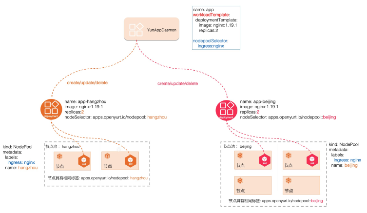

<a name="Ynuk5"></a>
# Description
<br />In edge scenarios，edge nodes from the same region are allocated to the same nodepool, generally it is necessary to deploy some system components at the nodepool level, such as CoreDNS. When a nodepool is created, we want these system components bo be created automatically without any manual actions.
<br />
<br />YurtAppDaemon ensures all or some nodepools run replicas with Deployment or StatefulSet as template. With the nodepools are created, these child Deployments or Statefulsets are added into the cluster as well, and the creation/update of the child Deployments or Statefulsets are implemented by the YurtAppDaemon controller. These child Deployments or Statefulsets will be recycled when the nodepool is removed from the cluster, and deleting the YurtAppDaemon CR will cleanup the Deployments or StatefulSets it created. The behavior of YurtAppDaemon is similar to K8S Daemonset, the difference is YurtAppDaemon creates K8S workload automatically from the nodepool level.<br />​

<a name="PGkba"></a>
## YurtAppDamon Supported Features

- Support Deployment and Statefulset as template
- Support template update and trigger sub-resources update, such as image update of the Deployment template will trigger the child Deployment image update accordingly
- Support auto distribution of the template resources from the nodepool level:
  - When the nodepools match the corresponding label, sub-resources are created automatically
  - When the nodepools delete the corresponding label, sub-resources are deleted automatically

​<br />
<a name="cvH4w"></a>
## YurtAppDamon & YurtAppSet

<a name="RFvu8"></a>
### YurtAppSet


<a name="JML1n"></a>
### YurtAppDaemon


<a name="th18J"></a>
# Demo
<a name="e5xUz"></a>
## create nodepool  test1
```bash
cat <<EOF | kubectl apply -f -
apiVersion: apps.openyurt.io/v1alpha1
kind: NodePool
metadata:
  name: test1
spec:
  selector:
    matchLabels:
      apps.openyurt.io/nodepool: test1
  type: Edge
EOF
```

<a name="rfeAg"></a>
## create nodepool  test2
```bash
cat <<EOF | kubectl apply -f -

apiVersion: apps.openyurt.io/v1alpha1
kind: NodePool
metadata:
  name: test2
spec:
  selector:
    matchLabels:
      apps.openyurt.io/nodepool: test2
  type: Edge

EOF
```
<a name="ztrk6"></a>
## add node to nodepool
```bash
 kubectl label node cn-beijing.172.23.142.31 apps.openyurt.io/desired-nodepool=test1
 kubectl label node cn-beijing.172.23.142.32 apps.openyurt.io/desired-nodepool=test1

 kubectl label node cn-beijing.172.23.142.34 apps.openyurt.io/desired-nodepool=test2
 kubectl label node cn-beijing.172.23.142.35 apps.openyurt.io/desired-nodepool=test2

```

<a name="LKPk3"></a>
## create yurtappdaemon
```bash
cat <<EOF | kubectl apply -f -

apiVersion: apps.openyurt.io/v1alpha1
kind: YurtAppDaemon
metadata:
  name: daemon-1
  namespace: default
spec:
  selector:
    matchLabels:
      app: daemon-1

  workloadTemplate:
    deploymentTemplate:
      metadata:
        labels:
          app: daemon-1
      spec:
        replicas: 1
        selector:
          matchLabels:
            app: daemon-1
        template:
          metadata:
            labels:
              app: daemon-1
          spec:
            containers:
            - image: nginx:1.18.0
              imagePullPolicy: Always
              name: nginx
  nodepoolSelector:
    matchLabels:
      yurtappdaemon.openyurt.io/type: "nginx"

EOF
```

<a name="F67pd"></a>
## label for nodepool test1
```bash
kubectl label np test1 yurtappdaemon.openyurt.io/type=nginx

# Check the Deployment
kubectl get deployments.apps

# Check the Deployment nodeselector

# Check the Pod
```

<a name="MnFOK"></a>
## label for nodepool test2
```bash
kubectl label np test2 yurtappdaemon.openyurt.io/type=nginx

# Check the Deployment
kubectl get deployments.apps

# Check the Deployment nodeselector

# Check the Pod
```

<a name="bo5kt"></a>
## change yurtAppDaemon

```bash
# Change yurtappdaemon workloadTemplate replicas to 2

# Change yurtappdaemon workloadTemplate image to nginx:1.19.0

# Check the Pod
```

<a name="UTCfl"></a>
## remove nodepool label
```bash
# Remove the nodepool test1 label
kubectl label np test1 yurtappdaemon.openyurt.io/type-

# Check the Deployment

# Check the Pod

# Remove the nodepool test2 label
kubectl label np test2 yurtappdaemon.openyurt.io/type-

# Check the Deployment

# Check the Pod

```
